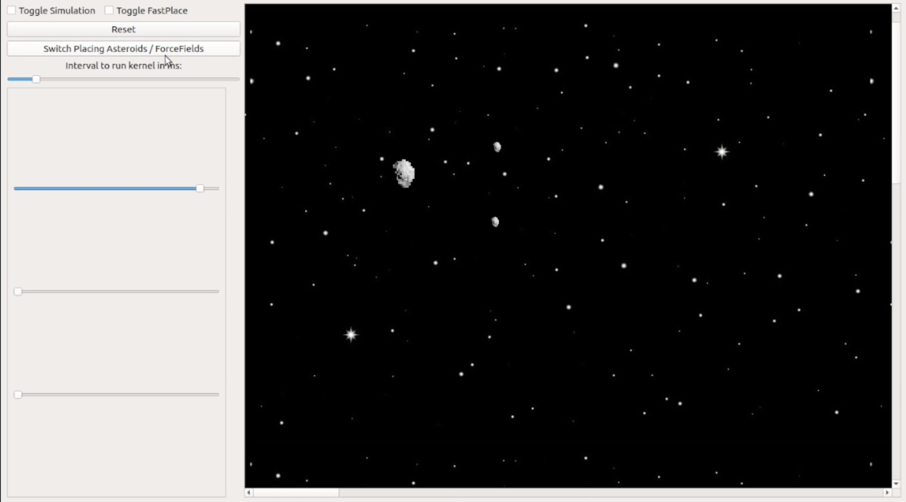

# N-Body Simulation GPU Project

This project simulates the interactions between bodies and force fields using CUDA for computation.
The project includes a graphical user interface (GUI) developed with Qt, which allows users to interact with the simulation by placing asteroids and force fields, changing the mass of the asteroids, and more.

## Features

- **Graphical User Interface (GUI)**: Developed with Qt, providing an interactive way to place and manipulate asteroids and force fields.
- **CUDA Computation**: Efficiently calculates interactions between bodies using GPU acceleration.
- **Asteroid and Force Fields**: Users can place asteroids and force fields that influence the asteroids.
- **Mass Adjustment**: Change the mass of the asteroids using a slider.
- **Fast Place Mode**: Toggle this mode to drag the mouse over the screen and add many asteroids quickly.
- **Reset Button**: Clear all asteroids and force fields.
- **Start Simulation**: Start the simulation to observe the interactions.

## Development

This project was developed during the course "GPU Project" at Osnabrück University during the winter semester 2021/2022 by Daniel, Leonard and Theo.

## Usage

1. **Placing Asteroids and Force Fields**:
    - Use the GUI to place asteroids and force fields.
    - Adjust the mass of the asteroids using the provided slider.

2. **Fast Place Mode**:
    - Toggle the fast place mode to quickly add multiple asteroids by dragging the mouse.

3. **Reset and Start Simulation**:
    - Use the reset button to clear all objects.
    - Click the start button to begin the simulation.

## Screenshots and other Documentation

### GUI Overview

### Other Documentation
A explanatory video, slides and a detailed project documentation in pdf are located in the repository. All the media is in German.

## Prerequisites

- **CUDA**: Ensure your system has a compatible GPU and CUDA 10.2+ toolkit installed.
- **Qt**: Install Qt5 for the GUI.

## License

This project is licensed under the MIT License - see the [LICENSE](LICENSE) file for details.

---

Thank you for exploring the N-Body Simulation GPU Project! We hope you find it interesting and educational.

---
